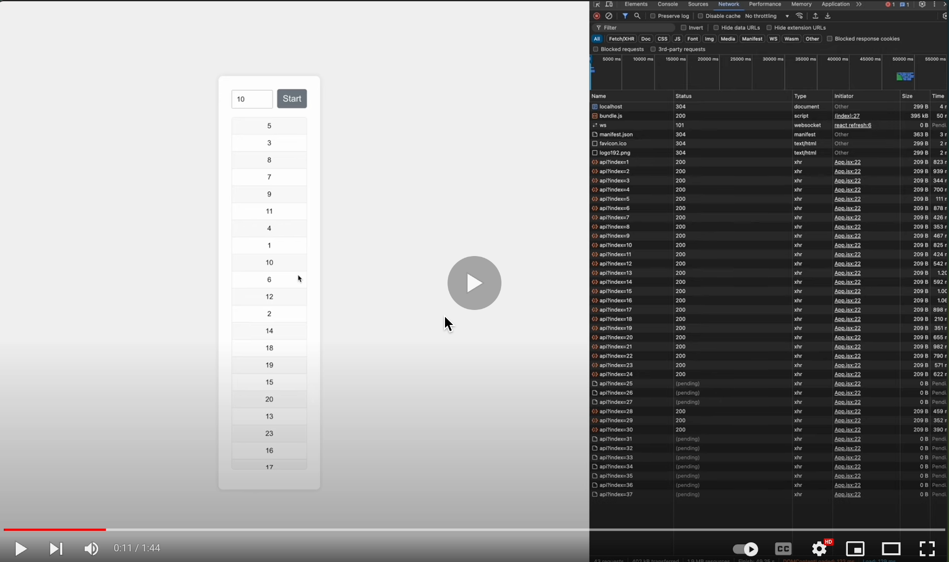

Implement client-server data fetch logic by following the next steps:

1. Display an input (required, type number, from 0 to 100) and the "Start" button. Clicking the "Start" button you will disable it and start sending 1000 asynchronous HTTP requests to a server's "/api" endpoint in the following way:
   1. The input value should be used as a concurrency limit, e.g. if concurrency is 10 - you should always have 10 active requests in your browser network console.
   2. The input value should be used as requests limit per second, e.g. 10 requests per second.
   3. Send a request index (1, 2, 3, ....) to a server
2. Server-side logic should handle requests to "/api" endpoint:
   1. Make a random delay before sending a response: from 1ms to 1000ms
   2. A successful response data should be an index from a request
   3. Return 429-code error response if received more than 50 requests per second
3. Client-side JS should render the results of server responses (request indexes) to one list immediately after each response

You can choose any technology stack that you will use to implement the logic.

